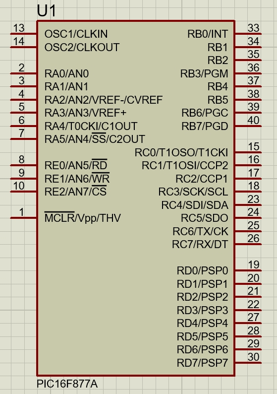
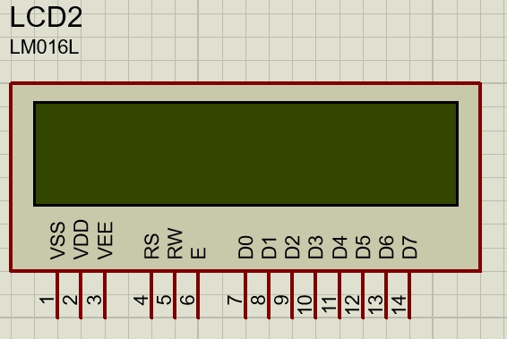
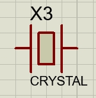
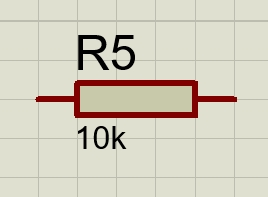
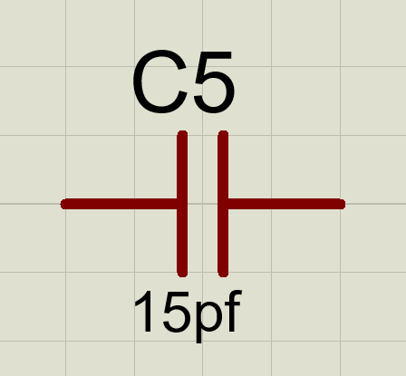
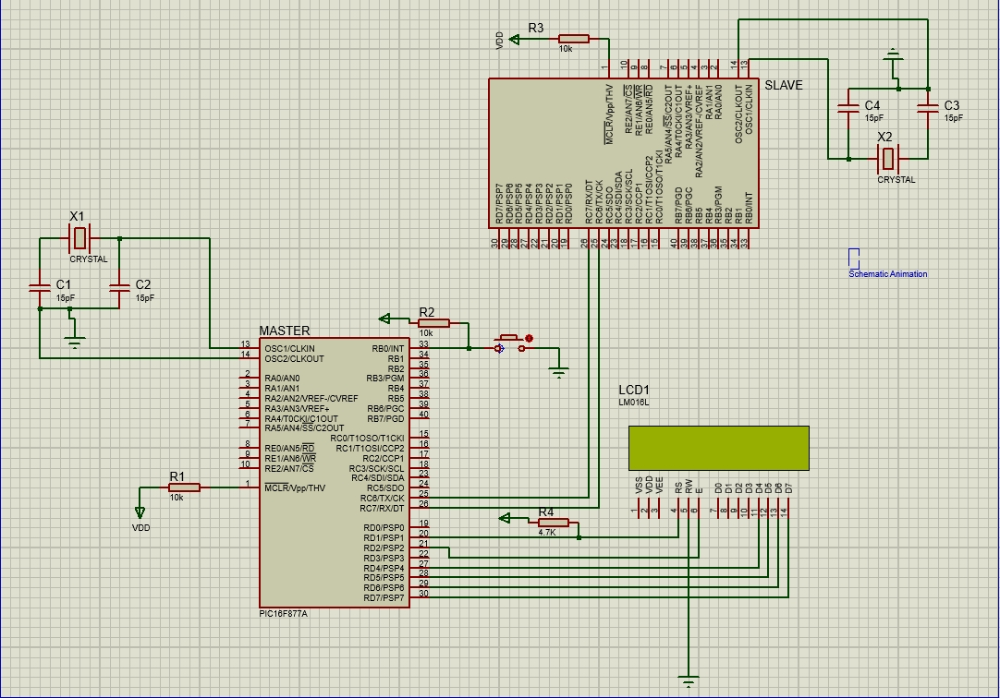
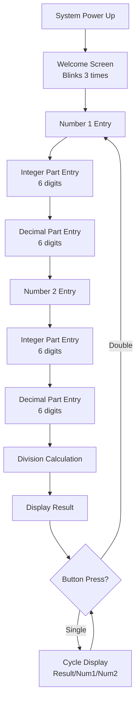
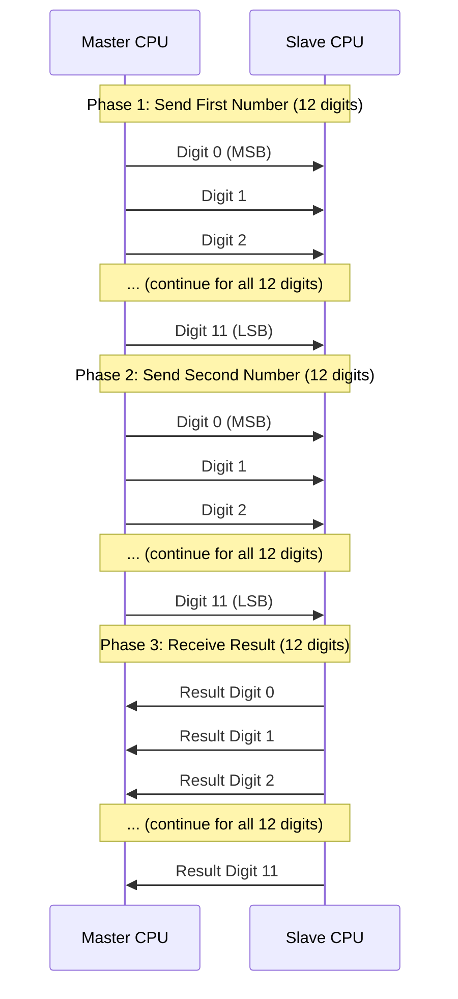
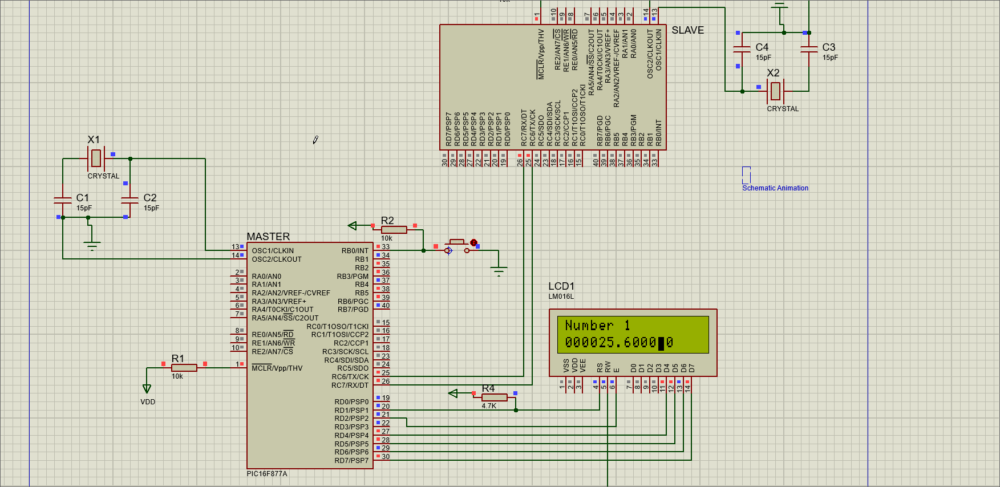

# 🧮 PIC Float Division Calculator

<div align="center">


</div>

---

## 📑 Table of Contents

- [📖 Project Overview](#-project-overview)
- [🏗️ System Architecture](#️-system-architecture)
  - [🔧 Hardware Components](#-hardware-components)
  - [🖥️ Component Layout](#️-component-layout)
  - [📷 Hardware Components Gallery](#-hardware-components-gallery)
- [🔄 System Operation Flow](#-system-operation-flow)
  - [📱 User Interface Flow](#-user-interface-flow)
  - [🤝 Master-Slave Communication Protocol](#-master-slave-communication-protocol)
- [💻 Software Architecture](#-software-architecture)
  - [🎛️ Master CPU Functions](#️-master-cpu-functions)
  - [⚙️ Slave CPU Functions](#️-slave-cpu-functions)
- [🛠️ Development Environment](#️-development-environment)
- [🎮 Usage Instructions](#-usage-instructions)
- [🎬 Demonstration](#-demonstration)
- [📁 Project Structure](#-project-structure)
- [🔬 Technical Specifications](#-technical-specifications)
- [👥 Contributors](#-contributors)
- [📜 License](#-license)

---

## 📖 Project Overview

This project implements a **complex floating-point division calculator** using two PIC16F877A microcontrollers working in a master-slave architecture. The system can perform division operations on float numbers up to 1 million (10⁶) with decimal precision up to 6 digits (e.g., 999999.999999).

### 🎯 Key Features
- **Dual MCU Architecture**: Master-Slave communication using USART
- **Floating-Point Precision**: 6.6 fixed-point arithmetic (6 integer + 6 decimal digits)
- **Interactive Input**: Push-button digit entry with timeout and double-click detection
- **LCD Display**: 16×2 character display with cursor control
- **Hardware Simulation**: Complete Proteus simulation environment

---

## 🏗️ System Architecture

<div align="center">

### 🔧 Hardware Components

| Component | Quantity | Description | Connection |
|-----------|----------|-------------|------------|
| **PIC16F877A** | 2 | Master CPU & Co-processor | USART Communication |
| **16×2 LCD** | 1 | Character Display | 4-bit mode to Master PORTD |
| **Push Button** | 1 | Input Interface | Master PORTB.0 |
| **4MHz Crystal** | 2 | System Clock | Each MCU |
| **Resistors** | Various | Pull-up resistors | 4.7KΩ, 10KΩ |
| **Capacitors** | 4 | Crystal oscillators | 15pF each |

</div>

### 🖥️ Component Layout

<div style="display: flex; justify-content: space-around; margin: 20px 0;">

<div style="text-align: center; flex: 1;">

#### Master CPU (16F877A)
- **PORTB.0**: Push Button Input
- **PORTD**: LCD Interface (4-bit mode)
- **PORTC**: USART Communication
- **MCLR**: 10KΩ Pull-up

</div>

<div style="text-align: center; flex: 1;">

#### Slave CPU (16F877A)
- **PORTC**: USART Communication
- **PORTD**: Status LEDs (Optional)
- **MCLR**: 10KΩ Pull-up

</div>

<div style="text-align: center; flex: 1;">

#### LCD Display (16×2)
- **4-bit Data Mode**: D4-D7 → PORTD.4-7
- **Control Pins**: RS, EN → PORTD.2-3
- **RS Pull-up**: 4.7KΩ resistor

</div>

</div>

### 📷 Hardware Components Gallery

<div align="center">

#### 🔧 Individual Components

| PIC16F877A Microcontroller | 16×2 LCD Display | Push Button | 4MHz Crystal |
|:--------------------------:|:----------------:|:-----------:|:------------:|
|  |  |  |  |
| *Main processing unit* | *User interface display* | *Input interface* | *System clock source* |

| Pull-up Resistors | Capacitors (15pF) |
|:-----------------:|:------------------:|
|  |  |
| *4.7KΩ & 10KΩ values* | *Crystal oscillator caps* |

#### 🔌 Complete Circuit Design

<div style="margin: 30px 0;">



*Complete Proteus simulation schematic showing the dual PIC16F877A architecture with Master-Slave communication, LCD interface, push button input, and all supporting components including crystals, resistors, and capacitors.*

</div>

</div>

---

## 🔄 System Operation Flow

### 📱 User Interface Flow



### 🤝 Master-Slave Communication Protocol



**Communication Details:**
- **Protocol**: Simple USART transmission without acknowledgment
- **Baud Rate**: 9600 bps
- **Data Format**: 8-bit, no parity, 1 stop bit
- **Timing**: 5ms delay between each byte transmission
- **Flow**: Sequential transmission of 12-digit numbers as individual bytes

---

## 💻 Software Architecture

### 🎛️ Master CPU Functions

<div style="display: grid; grid-template-columns: 1fr 1fr; gap: 20px;">

<div>

#### 🖥️ Display Management
- **LCD Initialization**: 4-bit mode setup
- **Welcome Screen**: Blinking animation
- **Number Entry**: Cursor positioning
- **Result Display**: Formatted output

</div>

<div>

#### 🎮 Input Handling
- **Button Debouncing**: Clean signal processing
- **Timeout Detection**: Auto-advance after 1 second
- **Double-Click**: Fast navigation
- **Digit Increment**: 0-9 cycling

</div>

</div>

#### 📡 Communication Protocol
```assembly
; Master sends data without acknowledgment
usart_send_byte:
    BANKSEL TXSTA
    BTFSS   TXSTA, TRMT    ; Wait for transmit buffer empty
    GOTO    $-1
    BANKSEL TXREG
    MOVWF   TXREG          ; Send byte
    RETURN

; Transmission with 5ms delay between bytes
transmit_first_number_to_slave:
    CLRF    transmit_index
transmit_loop:
    MOVF    transmit_index, 0
    ADDLW   digit_array1_0
    MOVWF   FSR
    MOVF    INDF, 0
    CALL    usart_send_byte
    CALL    delay_5ms      ; 5ms delay between transmissions
    INCF    transmit_index, 1
    MOVF    transmit_index, 0
    SUBLW   .12
    BTFSS   STATUS, Z
    GOTO    transmit_loop
    RETURN
```

### ⚙️ Slave CPU Functions

#### 🔢 Division Algorithm
The slave implements a **18×12 decimal division** algorithm:
- **Input Scaling**: 12-digit dividend → 18-digit (shifted 6 places)
- **Precision**: 6.6 fixed-point arithmetic
- **Algorithm**: Long division with decimal precision

```assembly
perform_18x12_division:
    ; Initialize 13-digit working remainder
    ; Process 18 dividend digits
    ; Generate 12 quotient digits (6.6 format)
```

#### 🧮 Key Mathematical Operations
- **Multi-digit Comparison**: 13×12 number comparison
- **Multi-digit Subtraction**: With borrow propagation
- **Fixed-Point Conversion**: Integer to 6.6 format

---

## 🛠️ Development Environment

### 📋 Prerequisites
- **MPLAB IDE**: PIC development environment
- **Proteus**: Circuit simulation software
- **PIC16F877A**: Target microcontroller knowledge

### 🔧 Build Instructions

1. **Clone Repository**
   ```bash
   git clone https://github.com/osaidnur/PIC-Float-Division-Calculator.git
   cd PIC-Float-Division-Calculator
   ```

2. **MPLAB Setup**
   - Open `master/master.mcp` for Master CPU project
   - Open `slave/slave.mcp` for Slave CPU project
   - Build both projects to generate `.hex` files

3. **Proteus Simulation**
   - Open `Circuit.pdsprj`
   - Load `master.hex` into Master PIC16F877A
   - Load `slave.hex` into Slave PIC16F877A
   - Run simulation

---

## 🎮 Usage Instructions

### 🚀 Getting Started

1. **Power Up**: System displays welcome message
2. **Number Entry**: Use push button to increment digits
3. **Navigation**: 
   - **Single Click**: Increment current digit
   - **Wait 1 second**: Advance to next digit
   - **Double Click**: Skip to decimal part or next number
4. **Calculation**: Automatic after second number entry
5. **Result Viewing**: Button cycles through result/numbers

### 📊 Input Format
- **Range**: 0.000001 to 999999.999999
- **Precision**: 6 decimal places
- **Format**: NNNNNN.DDDDDD (6 integer + 6 decimal)

---

## 🎬 Demonstration

### 📹 Simulation Video
> **[📺 Watch Simulation Demo](simulation-demo.mp4)**
> 
> *Complete demonstration showing number entry, calculation, and result display*

### 📸 Screenshots

<div style="display: grid; grid-template-columns: 1fr 1fr; gap: 20px;">

<div align="center">

#### Welcome Screen

*System startup with blinking welcome message*

</div>

<div align="center">

#### Number Entry

*Interactive digit entry with cursor*

</div>

<div align="center">

#### Calculation Process

*Master-slave communication during division*

</div>

<div align="center">

#### Result Display

*Final result with formatting*

</div>

</div>

---

## 📁 Project Structure

```
PIC-Float-Division-Calculator/
├── 📄 README.md                    # This documentation
├── 📄 project4_description.pdf     # Original requirements
├── 🔌 Circuit.pdsprj              # Proteus simulation file
├── 📁 master/                      # Master CPU code
│   ├── 📄 master.asm              # Main assembly source
│   ├── 📄 master.hex              # Compiled hex file
│   ├── 📄 master.mcp              # MPLAB project
│   ├── 📄 16f877a_g.lkr          # Linker script
│   ├── 📄 LCDIS.INC              # LCD library
│   └── 📄 P16F877A.INC           # MCU definitions
├── 📁 slave/                       # Slave CPU code
│   ├── 📄 slave.asm               # Main assembly source
│   ├── 📄 slave.hex               # Compiled hex file
│   └── 📄 slave.mcp               # MPLAB project
├── 📁 Project Backups/            # Automatic backups
└── 📁 images/                      # Documentation images
```

---

## 🔬 Technical Specifications

### ⚡ Performance Metrics
- **Clock Speed**: 4 MHz per MCU
- **Communication**: 9600 baud USART
- **Precision**: 6 decimal places
- **Response Time**: < 2 seconds for division
- **Memory Usage**: ~80% of available RAM

### 🎯 Algorithm Complexity
- **Division Algorithm**: O(n×m) where n=18, m=12
- **Decimal Operations**: BCD-like digit manipulation
- **Communication**: Interrupt-driven for efficiency

---

## 👥 Contributors

<div align="center">

### 🌟 Meet Our Amazing Team

<table>
<tr>
<td align="center" width="25%">
<a href="https://github.com/3ahma">

<br />
<b>Ahmad Hussin</b>
</a>
</td>
<td align="center" width="25%">
<a href="https://github.com/SuperMoathx7">

<br />
<b>Moath Wajeeh</b>
</a>
</td>
<td align="center" width="25%">
<a href="https://github.com/MoaidKarakra">

<br />
<b>Moaid Karakra</b>
</a>
</td>
<td align="center" width="25%">
<a href="https://github.com/osaidnur">

<br />
<b>Osaid Nur</b>
</a>
</td>
</tr>
</table>

<div style="margin-top: 20px;">

### 🤝 Team Collaboration Stats


</div>

</div>

---

## 📜 License

This project is licensed under the Apache License - see the [LICENSE](LICENSE) file for details.

---

